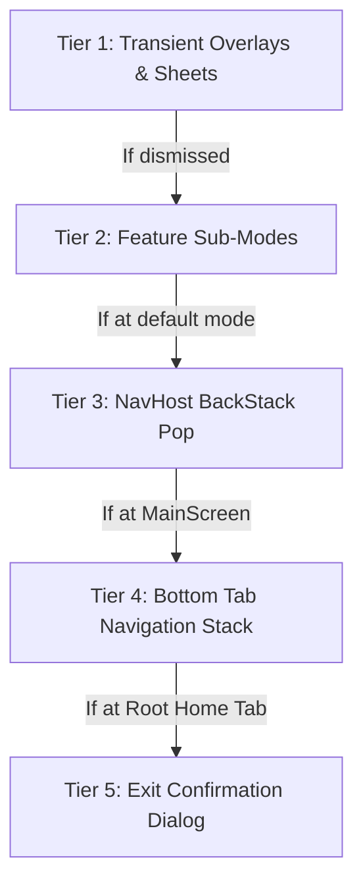

# 🧭 GLOBAL BACK NAVIGATION ARCHITECTURE & AGENT SPECIFICATION

> **CRITICAL DIRECTIVE FOR ALL FUTURE AI AGENTS & DEVELOPERS:**
> This document specifies the Single Source of Truth (SSOT) for Back Navigation across this application. 
> Whenever you create a new screen, modal, bottom sheet, sub-flow, or tab, you **MUST** adhere to the 5-tier hierarchical back navigation protocol outlined below.
> **NEVER** allow the app to abruptly terminate or jump directly to the homepage when the user was expecting to return to the previous page or dismiss an active view.

---

## 🏛️ 1. The 5-Tier Hierarchical Back Navigation Protocol

Android 14/15+ and modern Jetpack Compose use a Last-In, First-Out (LIFO) back dispatching mechanism. Every screen in this app must respect the following 5 levels of navigation depth:



### 🔹 Tier 1: Transient Overlays, Bottom Sheets & Search Focus
- **Rule:** If a bottom sheet, dialog, search input, or temporary overlay is open, pressing the system back button or top bar back button **MUST dismiss the overlay first** before popping the screen.
- **Examples:**
  - `PhonicsScreen`: If `uiState.detailItem != null` (detail sheet open), back dismisses the sheet via `viewModel.onDetailDismiss()`.
  - `PdfViewerScreen`: If `uiState.activeSheet != PdfActiveSheet.NONE` (thumbnails/bookmarks/settings sheet open), back calls `viewModel.closeSheet()`.
  - `HomeScreen`: If search query is active (`state.searchQuery.isNotBlank()`), back calls `viewModel.onClearSearch()`.

### 🔹 Tier 2: Feature Sub-Modes & Internal Views
- **Rule:** If a feature has multiple display or study modes (e.g. Soundboard vs Picture Book vs Word Builder), pressing back should first transition the user back to the primary/parent mode of that feature.
- **Example:**
  - `PhonicsScreen`: In `STORYBOOK` or `WORD_BUILDER` mode, pressing back returns to `SOUNDBOARD` mode before leaving the screen.

### 🔹 Tier 3: NavHost Screen Pop (`NavController.popBackStack()`)
- **Rule:** When no sub-modes or overlays are active, pressing back pops the current screen from `NavHostController` back to the exact screen the user navigated from.
- **TopBar Symmetry Rule:** The TopBar back button (`onNavigationClick`) and the system back button/gesture (`BackHandler`) **MUST execute the exact same logic**.

### 🔹 Tier 4: Bottom Navigation Tab BackStack History (`MainScreen`)
- **Rule:** When switching between primary tabs (`Home`, `KidsZone`, `Favorites`, `Settings`), the app maintains a deduplicated tab history stack (`tabBackStack`).
- **Behavior:**
  - Navigating `Home -> KidsZone -> Favorites` creates stack `[Home, KidsZone, Favorites]`.
  - Pressing Back pops `Favorites` and reveals `KidsZone`.
  - Pressing Back again pops `KidsZone` and reveals `Home`.
  - Explicitly tapping the `Home` bottom navigation icon flushes the intermediate tab stack directly back to `[Home]`.

### 🔹 Tier 5: Root Exit Confirmation Guard (`ExitConfirmationDialog`)
- **Rule:** When the user is at the root destination (`Screen.Home` in `MainScreen` with `tabBackStack.size == 1`), pressing back **MUST NEVER kill the app instantly**.
- **Behavior:**
  - It triggers `ExitConfirmationDialog` asking: *"আপনি কি নিশ্চিত যে আপনি অ্যাপটি বন্ধ করতে চান?"*
  - **Cancel ("না"):** Dismisses the dialog, keeps user in the app.
  - **Confirm ("হ্যাঁ, প্রস্থান করুন"):** Executes `context.findActivity()?.finishAffinity()` to exit cleanly.

---

## 📋 2. Boilerplate Code for Future Screens

When building any new screen with sub-modes or sheets, copy and use this standard pattern:

```kotlin
@Composable
fun FeatureScreen(
    viewModel: FeatureViewModel,
    onBackClick: () -> Unit,
    modifier: Modifier = Modifier
) {
    val uiState by viewModel.uiState.collectAsStateWithLifecycle()

    // 1. Unified Back Action
    val handleBack: () -> Unit = {
        when {
            uiState.isDetailSheetOpen -> viewModel.dismissSheet()
            uiState.activeMode != FeatureMode.DEFAULT -> viewModel.setMode(FeatureMode.DEFAULT)
            else -> onBackClick() // Pops NavHost
        }
    }

    // 2. Hardware / System Back Handler
    BackHandler(enabled = true, onBack = handleBack)

    // 3. Symmetric TopBar Navigation Click
    Scaffold(
        topBar = {
            StandardTopBar(
                title = stringResource(R.string.feature_title),
                navigationIcon = Icons.AutoMirrored.Rounded.ArrowBack,
                onNavigationClick = handleBack
            )
        }
    ) { /* Screen content */ }
}
```

---

## 🚫 3. Anti-Patterns & Strict "Do Nots"

1. **NEVER use `BackHandler { currentTab = Screen.Home }`**:
   This resets the user directly to the home screen regardless of their navigation history, destroying user context. Always use the tab backstack.
2. **NEVER call `Activity.finish()` without confirmation at the root**:
   Always show `ExitConfirmationDialog` at the root destination.
3. **NEVER leave BottomSheets or Dialogs unhandled by `BackHandler`**:
   If a user presses back while a modal is visible, the modal must close without closing the screen.
4. **NEVER use hardcoded English strings or emojis in navigation dialogs**:
   Always reference `R.string.exit_dialog_*` and Material 3 Vector Icons.
5. **NEVER use bare `remember` for navigation history stacks**:
   Always use `rememberSaveable` (with String identifiers or native Bundles) for `tabBackStack` and `modeBackStack`. Bare `remember` resets to default whenever the destination is popped, causing the user to be thrown to the homepage instead of their originating tab.
6. **MANDATORY Symmetric Visual TopBar Back Arrows**:
   All secondary tabs (`KidsZone`, `Favorites`, `Settings`) and sub-screens MUST provide a visual `Icons.AutoMirrored.Rounded.ArrowBack` in their `StandardTopBar` wired to the same back navigation function as the hardware gesture.
